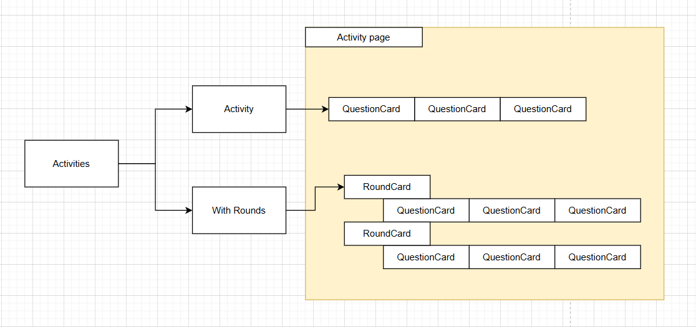

# Cambridge Task Application

This project is a **React + TypeScript** application built with **Vite**. It is designed to manage and display activities, questions, and results in a structured and interactive way. The application uses **React Context** for global state management, **CSS Modules** for styling, and **React Router** for navigation.

---

## **Table of Contents**
1. Features
2. Project Structure
3. Setup and Installation
4. Scripts
5. Key Components
6. State Management
7. Activity Flow Diagram
8. API Integration
9. Styling
10. Utilities

---

## **Features**
- Fetch and display activities from an external API.
- Navigate between different views: **Main**, **Activity**, and **Result**.
- Manage global state using React Context and `useReducer`.
- Dynamically render questions and rounds based on activity type (`base` or `round`).
- Display results with scores and feedback.
- Modular and reusable components like `Button`, `QuestionCard`, and `RoundCard`.
- Scoped styling using CSS Modules.

---

## **Project Structure**
The project is organized into the following folders:

```
src/
├── api/                # API service layer (NOT USED, since im only using one API)
├── assets/             # Static assets (e.g., images)
├── components/         # Reusable UI components
├── constants/          # Application constants (e.g., routes)
├── hooks/              # Custom React hooks (e.g., ActivityContext)
├── styles/             # CSS Modules for styling
├── types/              # TypeScript type definitions
├── utils/              # Utility functions (e.g., type guards, helpers)
├── views/              # Page-level components (Main, Activity, Result)
└── vite-env.d.ts       # Vite environment types
```

### **Key Files**
- **`src/app.tsx`**: Entry point of the application. Sets up routing and context providers.
- **`src/constants/Routes.ts`**: Centralized route definitions.
- **`src/hooks/ActivityContext.tsx`**: Manages global state for activities.
- **`src/api/activitiesApi.ts`**: Handles API calls to fetch activity data.
- **`src/utils/typeGuard.utils.ts`**: Type guards for validating activity data.
- **`src/views/Main.tsx`**: Displays the list of activities.
- **`src/views/Activity.tsx`**: Handles activity interactions (questions and rounds).
- **`src/views/Result.tsx`**: Displays the results and scores.

---

## **Setup and Installation**

### **Prerequisites**
- Node.js (v16 or higher)
- npm or yarn

### **Installation**
1. Clone the repository:
   ```bash
   git clone https://github.com/yelbenitez/yelbenitez.github.io.git
   cd cambridge-task
   ```

2. Install dependencies:
   ```bash
   npm install
   ```

3. Start the development server:
   ```bash
   npm run dev
   ```

4. Open the application in your browser at `http://localhost:5173`.

---

## **Scripts**
The following scripts are available in the package.json:

| Script         | Description                                      |
|----------------|--------------------------------------------------|
| `npm run dev`  | Starts the development server.                   |
| `npm run build`| Builds the application for production.           |
| `npm run lint` | Runs ESLint to check for code quality issues.    |
| `npm run format`| Formats code using Prettier.                    |

---

## **Key Components**

### **1. Button**
- File: Button.tsx
- A reusable button component with customizable styles and functionality.
- Props:
  - `isWide`: Makes the button full-width.
  - `isSmall`: Reduces the button size.
  - `func`: Callback function triggered on click.
  - `disabled`: Disables the button.

### **2. QuestionCard**
- File: QuestionCard.tsx
- Displays a question with options for "Correct" or "Incorrect."
- Props:
  - `question`: The question object.
  - `next`: Callback function to handle the next action.
  - `mode`: Determines the mode (`question` or `result`).

### **3. RoundCard**
- File: RoundCard.tsx
- Displays a round with the number of questions and a "Start" button.
- Props:
  - `round`: The round object.
  - `next`: Callback function to start the round.

---

## **State Management**
The application uses **React Context** and `useReducer` for global state management.

### **ActivityContext**
- File: ActivityContext.tsx
- Manages the global state for activities, including:
  - `activities`: List of activities.
  - `selectedActivity`: Index of the currently selected activity.
  - `flow`: The type of activity (`base` or `round`).

### **Reducer Actions**
- `SET_ACTIVITIES`: Updates the list of activities.
- `SET_SELECTED_ACTIVITY`: Updates the selected activity and flow type.

---

### **Activity Flow Diagram**

- The application uses a `base` or `round` activity flow.
- The `base` activity flow consists of a single question.
- The `round` activity flow consists of multiple rounds, each containing multiple questions.
- The `base` activity flow is a series of questions, presented using the `QuestionCard` component.
- The `round` activity flow is a series of rounds, each containing multiple questions (from here, same flow with `base` activity), presented using the `RoundCard` component.
- The `Result` view displays the scores and feedback for each question or round presented using the `QuestionCard` component (Stacked). In the case of `round` activity flow, the `Result` presented still using the `QuestionCard` component, but a round title is used on top of the list of questions as a proper divider in between each round.

## **API Integration**
The application fetches activity data from an external API.
Since im only using one API, i didnt use the service layer.
hence, this section is empty.

---

## **Styling**
The application uses **CSS Modules** for scoped styling.

### **Folder Structure**
```
styles/
├── App.css               # Global styles
├── components/           # Component-specific styles
│   ├── Button.module.css
│   ├── QuestionCard.module.css
│   └── RoundCard.module.css
└── views/                # View-specific styles
    ├── Activity.module.css
    ├── Main.module.css
    └── Result.module.css
```

---

## **Utilities**
The `utils/` folder contains helper functions for common tasks.

### **1. Type Guards**
- File: typeGuard.utils.ts
- Function: `isValidActivity`
  - Validates if an object is a valid `BaseActivityFlow` or `RoundActivityFlow`.
  - Since dealing with an object that have different properties

### **2. Activity Utilities**
- File: activity.utils.ts
- Functions:
  - `flowGuard`: Determines the flow type (`base` or `round`) of an activity.
  - `getQuestions`: Retrieves questions for a specific activity and round.

---